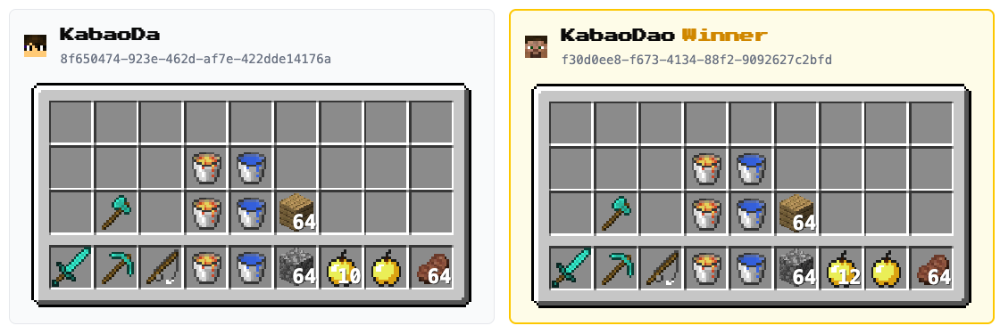

<h1 align="center">
  Minecraft Inventory UI
</h1>

<h2 align="center">
  Minecraft-style inventory UI component for React
<h2>

<p align="center">
  <a href="https://www.npmjs.com/package/minecraft-inventory-ui"></a>
  <a href="https://github.com/burigg/minecraft-inventory-ui/blob/main/LICENSE"></a>
  <a href="https://x.com/BuriNetwork"></a>
</p>

<p align="center">
  
</p>

## What's this package
A lightweight React component that renders a pixel-perfect Minecraft inventory UI.

### Features
- 🎮 **Authentic look** - Faithful recreation of Minecraft's inventory design
- 📦 **36-slot inventory** - Includes hotbar (9 slots) and main inventory (27 slots)
- 🔢 **Stack counts** - Displays item quantities with Minecraft-style text shadows
- 📐 **Scalable** - Easily resize the inventory with the `scale` prop
- 🖼️ **Built-in item icons** - Comes with common item sprites out of the box

Perfect for Minecraft server dashboards, fan projects, or any application that needs that classic blocky aesthetic.

## FAQ
### Is the `InventoryItem` type unusual?
We’re currently targeting v1.8, so it may not have the shape you expect.<br>
Support for newer versions is planned on the roadmap.

### Does it support a wide variety of items?
Not yet—we’re gradually adding support for more items.

### Why do items appear as “Missing/Error Texture”?
At the moment, we only support item types from v1.8.<br>
Our roadmap includes support for multiple item type versions.<br>
For details, please refer to `src/lib/itemIcon.ts`.

### Will you support the armor inventory?
Yes—it's on the roadmap.

### Will you display durability values?
Yes, implementation is planned.


## Quick Start
Add this pacakge to your project:
```shell
# choose your package manager

# with npm
$ npm i minecraft-inventory-ui

# with Yarn
$ yarn add minecraft-inventory-ui

# with pnpm
$ pnpm add minecraft-inventory-ui

# with Bun
$ bun add minecraft-inventory-ui
```

Insert minecraft-inventory-ui Component to your code:
```javascript
import { Inventory, type InventoryItem } from "minecraft-inventory-ui";

const SampleComponent = () => {
  let inventoryItems: (InventoryItem | null)[] = [];

  return (
    <>
      <Inventory scale={1} items={inventoryItems}>
    </>
  )
}
```

## Contributing
Work in Progress...

## Contact
There are several ways to contact:
  - [Discord](https://discord.buri.gg) (Contact at `#support` channel)
  - X ([@BuriNetwork](https://x.com/BuriNetwork))

## License
this project is [MIT licensed](https://github.com/burigg/minecraft-inventory-ui/blob/main/LICENSE).